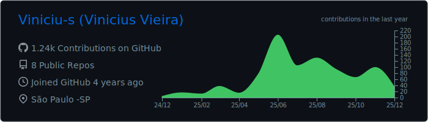
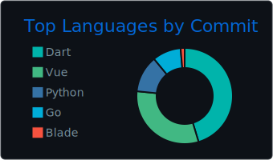

# 👋 Olá, eu sou o Vinicius Vieira

Sou **Desenvolvedor Full Stack** focado em criar soluções escaláveis, bem estruturadas e integração entre sistemas.  
Atualmente trabalho com containers, mensageria e bancos relacionais/não relacionais.

---

## 🚀 Stack

### Linguagens

### Front-end & Mobile

### Banco de Dados

### Infra & Mensageria

---

## 📊 Estatísticas

<!-- Cards detalhados do github-profile-summary-cards (SVGs locais, inclui privados, tema escuro) -->
<table>
	
	
</table>

## 🌐 Conecte-se comigo

  

